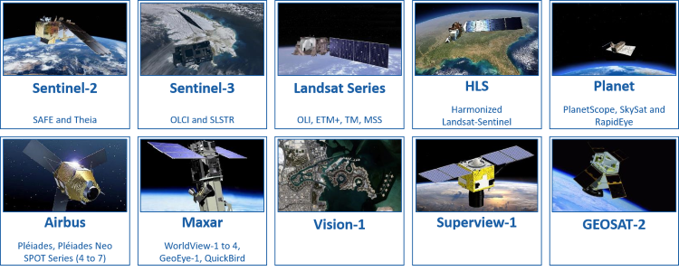

# Optical data

You will find an optical tutorial [here](https://eoreader.readthedocs.io/latest/notebooks/optical.html).

## Implemented optical constellation



The product resolution is the one given in [Data Access Portfolio (2014-2022, section 6.2)](https://spacedata.copernicus.eu/documents/20126/0/DAP+Release+phase2+V2_8.pdf/82297817-2b96-d3de-c397-776292336434?t=1633508426589). 
The Data Access Portfolio Document presents the offer of the datasets and data access services that are made available to the Copernicus Users in response to their Earth Observation data requirements.
However, especially for SAR data, the default pixel size of GRD bands is different from the product resolution!

| Constellations              | Class                                                              | Use archive                  |
|-----------------------------|--------------------------------------------------------------------|------------------------------|
| Sentinel-2                  | {meth}`~eoreader.products.optical.s2_product.S2Product`            | ✅                            |
| Sentinel-2 on AWS cloud     | {meth}`~eoreader.products.optical.s2_product.S2CloudProduct`       | -                            |
| Sentinel-2 Theia            | {meth}`~eoreader.products.optical.s2_theia_product.S2TheiaProduct` | ✅                            |
| Sentinel-3 SLSTR            | {meth}`~eoreader.products.optical.s3_slstr_product.S3SlstrProduct` | ✅                            |
| Sentinel-3 OLCI             | {meth}`~eoreader.products.optical.s3_olci_product.S3OlciProduct`   | ✅                            |
| Landsat 8/9 OLI-TIRS        | {meth}`~eoreader.products.optical.landsat_product.LandsatProduct`  | ✅                            |
| Landsat 7 ETM               | {meth}`~eoreader.products.optical.landsat_product.LandsatProduct`  | COL1*: ❌, COL2: ✅            |
| Landsat 4/5 TM              | {meth}`~eoreader.products.optical.landsat_product.LandsatProduct`  | COL1*: ❌, COL2: ✅            |
| Landsat 1-5 MSS             | {meth}`~eoreader.products.optical.landsat_product.LandsatProduct`  | COL1*: ❌, COL2: ✅            |
| Harmonized Landsat-Sentinel | {meth}`~eoreader.products.optical.hls_product.HlsProduct`          | ✅                            |
| PlanetScope                 | {meth}`~eoreader.products.optical.pla_product.PlaProduct`          | ✅(❌ if multiple subdatasets) |
| SkySat                      | {meth}`~eoreader.products.optical.sky_product.SkyProduct`          | ✅(❌ if multiple subdatasets) |
| RapidEye                    | {meth}`~eoreader.products.optical.re_product.ReProduct`            | ✅(❌ if multiple subdatasets) |
| Pleiades-Neo                | {meth}`~eoreader.products.optical.pneo_product.PneoProduct`        | ✅                            |
| Pleiades                    | {meth}`~eoreader.products.optical.pld_product.PldProduct`          | ✅                            |
| Vision-1                    | {meth}`~eoreader.products.optical.vis1_product.Vis1Product`        | ✅                            |
| SPOT 4/5                    | {meth}`~eoreader.products.optical.spot45_product.Spot45Product`    | ✅                            |
| SPOT 6/7                    | {meth}`~eoreader.products.optical.spot67_product.Spot67Product`    | ✅                            |
| Maxar**                     | {meth}`~eoreader.products.optical.maxar_product.MaxarProduct`      | ✅                            |
| SuperView-1                 | {meth}`~eoreader.products.optical.sv1_product.Sv1Product`          | ✅                            |
| GEOSAT-2                    | {meth}`~eoreader.products.optical.gs2_product.Gs2Product`          | ✅                            |

\* *Archived Landsat Collection-1 are not managed because of the tar.gz format, which is too slow to process. It is better to work on the extracted product. Landsat-9 Collection-1 products don't exist.*

\*\* *Maxar satellites: Worldview Legion, 2, 3, 4 and GeoEye-1 (but WorldView-1, QuickBird should work, but they don't have been tested). 

```{warning}
Satellites products that cannot be used as archived have to be extracted before use.
```

| Constellations              | Product Types             | Default Pixel Size                    |
|-----------------------------|---------------------------|---------------------------------------|
| Sentinel-2                  | L1C & L2A & L2Ap          | 10 m                                  |
| Sentinel-2 on AWS Cloud     | L2A (for now)             | 10 m                                  |
| Sentinel-2 Theia            | L2A                       | 10 m                                  |
| Sentinel-3 SLSTR            | RBT                       | 300 m                                 |
| Sentinel-3 OLCI             | EFR                       | 500 m                                 |
| Landsat 8/9 OLI-TIRS        | Level 1 & 2               | 30 m                                  |
| Landsat 7 ETM               | Level 1 & 2               | 30 m                                  |
| Landsat 4/5 TM              | Level 1 & 2               | 30 m                                  |
| Landsat 1-5 MSS             | Level 1                   | 60 m                                  |
| Harmonized Landsat-Sentinel | L30 & S30                 | 30 m                                  |
| PlanetScope                 | L3A & L3B                 | 3 m                                   |
| SkySat                      | (Collect Product) ortho_* | 0.5 m                                 |
| RapidEye                    | L3A                       | 5 m                                   |
| Pleiades-Neo                | SEN**, PRJ, ORT & MOS     | 0.3 m (PAN), 1.2 m (MS)               |
| Pleiades                    | SEN**, PRJ, ORT & MOS     | 0.5 m (PAN), 2 m (MS)                 |
| Vision-1                    | PRJ & ORTP                | 0.9 m (PAN), 3.5 m (MS)               |
| SPOT 4/5                    | L1A, L1B, L2A             | 10 m (PAN), 20 m (MS)                 |
| SPOT 6/7                    | SEN**, PRJ, ORT & MOS     | 1.5 m (PAN), 6 m (MS)                 |
| Maxar*                      | Standard & Ortho          | 0.3 to 0.5 m (PAN), 1.2 to 2.0 m (MS) |
| SuperView-1                 | L1B & L2A                 | 0.5 m (PAN), 2 m (MS)                 |
| GEOSAT-2                    | L1B & L1C & L1D & L1S     | 0.4 m (PAN), 2 m (MS) for L1D data    |

\* *Maxar satellites: Worldview Legion 2, 3, 4 and GeoEye-1 (but WorldView-1, QuickBird should work, but they don't have been tested). 

\*\* ⚠ *DIMAP SEN products are orthorectified using RPCs and not the rigorous sensor model. Shift can occur. Please refer to [this issue](https://github.com/sertit/eoreader/issues/53).*

```{note}
Note that for the rest of this documentation: 
- HLS.S30 and Sentinel-2 data are equivalent (with the only difference of a 30 m gsd).
- HLS.L30 and Landsat-OLI-TIRS data are equivalent.
```

The goal of **EOReader** is to implement every constellation that can be used in the [Copernicus Emergency Management Service](https://emergency.copernicus.eu/).
The constellations that can be used during CEMS activations are (as of 09/2021):  


## Optical bands

The following bands are available in **EOReader** but may not be available for all constellations.

```{warning}
EOReader loads bands in UTM. VHR bands can be orthorectified but EOReader needs a DEM for that.
Be sure to position the environment variable `EOREADER_DEM_PATH` to the DEM you want.
```

### Satellite bands

```{note}
Optical bands are always loaded in reflectance, except for brilliance temperature bands that are left as is. 

However, the user can ask for bands "as is" by using the {meth}`~eoreader.keyword.TO_REFLECTANCE` keyword with the load and stack functions.
It will give the bands in the provider format (either DN, radiance or reflactance in uint16...).
See [the optical notebook](https://eoreader.readthedocs.io/latest/notebooks/optical.html#radiometric-processing) to see how to implement it.

These bands will be cleaned according to the user's needs. 
By default, only the pixels outside the detectors footprints are set to nodata.
Methods to clean optical bands are best described in the
[notebook](https://eoreader.readthedocs.io/latest/notebooks/optical_cleaning_methods.html) about the optical cleaning methods.
```

#### Band names

These bands are mainly based on Sentinel-2 bands. 
The names are the ones from Sentinel-2, even if sometimes it can be confusing (especially for `Coastal Aerosol` and `SWIR Cirrus` bands).

Some additions to the Sentinel-2 bands have been made (`YELLOW`, `PAN`...):

- {meth}`~eoreader.bands.band_names.SpectralBandNames.CA`: Coastal Aerosol
- {meth}`~eoreader.bands.band_names.SpectralBandNames.BLUE`
- {meth}`~eoreader.bands.band_names.SpectralBandNames.GREEN_1`: First Green band of PlanetScope 8 bands, mapped to the fifth band of Sentinel-3 OLCI
- {meth}`~eoreader.bands.band_names.SpectralBandNames.GREEN`
- {meth}`~eoreader.bands.band_names.SpectralBandNames.YELLOW`
- {meth}`~eoreader.bands.band_names.SpectralBandNames.RED`
- {meth}`~eoreader.bands.band_names.SpectralBandNames.VRE_1`: Vegetation Red Edge 1
- {meth}`~eoreader.bands.band_names.SpectralBandNames.VRE_2`: Vegetation Red Edge 2
- {meth}`~eoreader.bands.band_names.SpectralBandNames.VRE_3`: Vegetation Red Edge 3
- {meth}`~eoreader.bands.band_names.SpectralBandNames.NIR`: Near Infrared
- {meth}`~eoreader.bands.band_names.SpectralBandNames.NARROW_NIR`: Spectrally resolved Narrow Near Infrared (band `8A` for `Sentinel-2`, same as `NIR` for other sensors)
- {meth}`~eoreader.bands.band_names.SpectralBandNames.WV`: Water vapour
- {meth}`~eoreader.bands.band_names.SpectralBandNames.SWIR_CIRRUS`: Cirrus band
- {meth}`~eoreader.bands.band_names.SpectralBandNames.SWIR_1`: Short Wave Infrared 1
- {meth}`~eoreader.bands.band_names.SpectralBandNames.SWIR_2` Short Wave Infrared 2
- {meth}`~eoreader.bands.band_names.SpectralBandNames.PAN`: Panchromatic
- {meth}`~eoreader.bands.band_names.SpectralBandNames.TIR_1`: Thermal Infrared 1
- {meth}`~eoreader.bands.band_names.SpectralBandNames.TIR_2`: Thermal Infrared 2

```{note}
Note that bands that are not mapped can still be used (i.e. for Sentinel-3 OLCI and SLSTR). 
They will be called by their true name (i.e. `F1` or `Oa05`). However, 
the mapped band will have to be called with their mapped name, i.e. `BLUE` rather than `Oa04` for Sentinel-3 OLCI.
But the bands that are not present in the `bands.__init__` file won't be recognized.
```

#### Optical band mapping between constellations

```{raw} html
:file: _static/optical_band_mapping_inline.html
```

Thermal bands are not represented in this plot. Here is the table of the mapping:

| Bands names (alias)          | Thermal IR (`TIR_1`) | Thermal IR (`TIR_2`) |
|------------------------------|----------------------|----------------------|
| Sentinel-3 SLSTR             | **8** (1km)          | **9** (1km)          |
| Landsat OLI-TIRS (8-9)       | **10** (100m)        | **11** (100m)        |
| Landsat ETM (7)              | **6** (60m)          | **6** (60m)          |
| Landsat TM (5-4)             | **6** (120m)         | **6** (120m)         |
| Landsat MSS (only Landsat-3) | **8** (240m)         | **8** (240m)         |

Not all bands of these constellations are mapped in EOReader. 
However, they can still be used by using directly their name (i.e. `F1` or `Oa05`)*  

### Sentinel-2 L2A specific bands

EOReader can now load (since v0.22.0) Sentinel-2 L2A specific bands (quality assurance bands) as any other band: 
- Aerosol optical thickness (`AOT`)
- Scene average water vapour (`WVP`)
- Scene classification layer (`SCL`)

### Cloud bands

Maximum 5 cloud bands are available, according to the files provided in the data. All the bands are rasterized and
orthorectified if needed (for Sentinel-2 or 3 data for example), ready to be stacked.

The only difference with the other bands is that the cloud bands are provided in `uint8` and have a nodata equal to 255.

- {meth}`~eoreader.bands.band_names.CloudsBandNames.RAW_CLOUDS`: Raw Cloud file as provided (the only changes are the
  orthorectification and rasterization). Can provide other flags, or cloud probability.
- {meth}`~eoreader.bands.band_names.CloudsBandNames.CLOUDS`: Cloud presence (1) or absence (0). If clouds are provided in
  probabilities, their presence is determined according to Landsat definition (proba> 67%)
- {meth}`~eoreader.bands.band_names.CloudsBandNames.CIRRUS`: Cirrus presence (1) or absence (0). If clouds are provided in
  probabilities, their presence is determined according to Landsat definition (proba> 67%)
- {meth}`~eoreader.bands.band_names.CloudsBandNames.SHADOWS`: Shadows presence (1) or absence (0). If clouds are provided in
  probabilities, their presence is determined according to Landsat definition (proba> 67%)
- {meth}`~eoreader.bands.band_names.CloudsBandNames.ALL_CLOUDS`: Cloud **OR** Cirrus **OR** Shadows presence (1) or absence (0).  
  Do not take into account missing bands (i.e. for Landsat MSS constellation, `ALL_CLOUDS` == `CLOUDS`)

| Sensors                      | Cloud files | Clouds Bands                                              |
|------------------------------|-------------|-----------------------------------------------------------|
| Sentinel-2                   | ✅           | `RAW_CLOUDS`, `CLOUDS`, `CIRRUS`, `ALL_CLOUDS`            |
| Sentinel-2 Theia             | ✅           | `RAW_CLOUDS`, `CLOUDS`, `SHADOWS`, `CIRRUS`, `ALL_CLOUDS` |
| Sentinel-3 OLCI              | ❌           |                                                           |
| Sentinel-3 SLSTR             | ✅           | `RAW_CLOUDS`, `CLOUDS`, `CIRRUS`, `ALL_CLOUDS`            |
| Landsat 8/9                  | ✅           | `RAW_CLOUDS`, `CLOUDS`, `SHADOWS`, `CIRRUS`, `ALL_CLOUDS` |
| Landsat 7                    | ✅           | `RAW_CLOUDS`, `CLOUDS`, `SHADOWS`, `ALL_CLOUDS`           |
| Landsat 4/5 TM               | ✅           | `RAW_CLOUDS`, `CLOUDS`, `SHADOWS`, `ALL_CLOUDS`           |
| Landsat 1-5 MSS              | ✅           | `RAW_CLOUDS`, `CLOUDS`, `ALL_CLOUDS`                      |
| Harmonized Landsat-Sentinel  | ✅           | `RAW_CLOUDS`, `CLOUDS`, `SHADOWS`, `CIRRUS`, `ALL_CLOUDS` |
| PlanetScope                  | ✅           | `RAW_CLOUDS`, `CLOUDS`, `SHADOWS`, `CIRRUS`, `ALL_CLOUDS` |
| SkySat                       | ✅           | `RAW_CLOUDS`, `CLOUDS`, `SHADOWS`, `CIRRUS`, `ALL_CLOUDS` |
| RapidEye                     | ✅           | `RAW_CLOUDS`, `CLOUDS`, `ALL_CLOUDS`                      |
| Pleiades                     | ✅           | `RAW_CLOUDS`, `CLOUDS`, `ALL_CLOUDS`                      |
| Pleiades-Neo                 | ✅           | `RAW_CLOUDS`, `CLOUDS`, `ALL_CLOUDS`                      |
| SPOT-4/5                     | ❌           |                                                           |
| SPOT-6/7                     | ✅           | `RAW_CLOUDS`, `CLOUDS`, `ALL_CLOUDS`                      |
| Vision-1                     | ❌           |                                                           |
| Maxar (GeoEye-1, WorldViews) | ❌           |                                                           |
| SuperView-1                  | ❌           |                                                           |
| GEOSAT-2                     | ❌           |                                                           |

### DEM bands

Optical constellations can all load {meth}`~eoreader.bands.band_names.DemBandNames.DEM`, {meth}`~eoreader.bands.band_names.DemBandNames.SLOPE`
and {meth}`~eoreader.bands.band_names.DemBandNames.HILLSHADE` bands. 
The `SLOPE` band is given in degrees. 
Please post an issue if you need this band in `percent`.

Use the environment variable `EOREADER_DEM_PATH` to position your worldwide DEM. You can
use both a local path e.g. `/mnt/dataserver/dems/srtm_30_v4/index.vrt` or `\\dataserver\DEMS\srtm_30_v4\index.vrt` or
a URL pointing to a web resources hosted on a S3 compatible storage e.g. 
`https://s3.storage.com/dem-bucket/srtm_cog.tif` (not available on Windows for now).

### Available spectral indices

EOReader uses (from version 0.18.0) the indices described in the 
[awesome spectral indices (ASI)](https://awesome-ee-spectral-indices.readthedocs.io/en/latest/) project.

> ⚠ You may need to install the last `spyndex` directly from GitHub latest version to have all available indices:
> `pip uninstall spyndex && pip install -U --no-deps git+https://github.com/awesome-spectral-indices/spyndex.git`

In addition to all these indices, EOReader kept the following indices for legacy purposes:

| Spectral Indices         | ASI equivalent   | Formulas (with ASI syntax)                                                     | Name                                                |
|--------------------------|------------------|--------------------------------------------------------------------------------|-----------------------------------------------------|
| `NDMI21` (or `NDMI2100`) | ❌                | `(N - S2) / (N + S2)`                                                          | Normalized Difference Moisture Index (with 2100 nm) || `NDRE1`                  | `NDREI`          | `(N - RE1) / (N + RE1)`                                                        | Normalized Difference Red Edge Index                |
| `NDRE2`                  | ❌                | `(N - RE2) / (N + RE2)`                                                        | Normalized Difference Red-Edge Index with RE2       |
| `NDRE3`                  | ❌                | `(N - RE3) / (N + RE3)`                                                        | Normalized Difference Red-Edge Index with RE1       |
| `CI32`                   | ❌                | `(RE3 / RE2) - 1`                                                              | Chlorophyll Index RedEdge RE3/RE2                   |
| `CI21`                   | ❌                | `(RE2 / RE1) - 1`                                                              | Chlorophyll Index RedEdge RE2/RE1                   |
| `SBI`                    | ❌                | `(R**2 + N**2)**0.5`                                                           | Soil Brightness Index                               |
| `SCI`                    | ❌                | `3*G - R - 100`                                                                | Soil Cuirass Index                                  |
| `SRSWIR`                 | ❌                | `S1/S2`                                                                        | Simple Ratio SWIR16/SWIR21 Clay Minerals            |
| `TCBRI`                  | ❌                | `0.3037 *B + 0.2793 * G + 0.4743 * R + 0.5585 * N + 0.5082 * S1 + 0.1863 * S2` | Tasseled Cap Brightness                             |
| `TCGRE`                  | ❌                | `0.2848 *B + 0.2435 * G + 0.5436 * R + 0.7243 * N + 0.0840 * S1 + 0.1800 * S2` | Tasseled Cap Greenness                              |
| `TCWET`                  | ❌                | `0.1509 *B + 0.1973 * G + 0.3279 * R + 0.3406 * N + 0.7112 * S1 + 0.4572 * S2` | Tasseled Cap Wetness                                |
| `WV_VI`                  | ❌                | `(WV - R) / (WV + R)`                                                          | WorldView Vegetation Index                          |
| `WV_WI`                  | ❌                | `(WV - A) / (WV + A)`                                                          | WorldView Water Index                               |

```{note}
WorldView-1 is not concerned by spectral indices as it only has a panchromatic band
```

Some indices are parametric (see the list [here](https://awesome-ee-spectral-indices.readthedocs.io/en/latest/index.html#expressions)). 
To add any parameter you can pass it to your load or stack functions:

```python
>>> prod.load("WDRVI", alpha=1)
```

### Masks

Since v0.22.0, EOReader can load masks directly in the `load` function.
However, the band masks are not exposed directly into `eoreader.bands`, but through their enums.
They can also be called by their string representation.

```python
# HLS FMASK mask, called through the enum
>>> from eoreader.bands import HlsMaskBandNames
>>> prod.load(HlsMaskBandNames.FMASK)
```

For Sentinel-2 et Sentinel-2 Theia data, some masks are band-specific and should be called with the `associated_bands` keywords.
This leads to a side effect that can be disorienting: these masks should be retrieved from the dataset with an unusual key (`{band}_{associated_band}`).

```python
>>> # Sentinel-2 Theia, called with mask strings
>>> masks = prod.load(["DFP", "EDG", "SAT", "MG2", "IAB", "IAB"], associated_bands={"SAT": "RED", "DFP": ["GREEN", "RED"]})

>>> # Show all variables
>>> masks.data_vars
Data variables:
    DFP_GREEN                 (band, y, x) 
    DFP_RED                   (band, y, x)
    S2TheiaMaskBandNames.EDG  (band, y, x)
    SAT_RED                   (band, y, x)
    S2TheiaMaskBandNames.MG2  (band, y, x)
    S2TheiaMaskBandNames.IAB  (band, y, x)

# Open saturation mask for green band
>>> masks["DFP_GREEN"]
<xarray.DataArray 'DFP_GREEN' (band: 1, y: 10980, x: 10980)> Size: 482MB
dask.array<where, shape=(1, 10980, 10980), dtype=float32, chunksize=(1, 1024, 1024), chunktype=numpy.ndarray>
Coordinates:
  * x            (x) float64 88kB 5e+05 5e+05 5e+05 ... 6.098e+05 6.098e+05
  * y            (y) float64 88kB 5.5e+06 5.5e+06 5.5e+06 ... 5.39e+06 5.39e+06
    spatial_ref  int64 8B 0
  * band         (band) int64 8B 1
Attributes:
    ...
```

See the different MaskBandNames enums to discover all the available masks and how to call them.
⚠ This feature is experimental.

## Documentary Sources

- [Data Access Portfolio (2014-2024)](https://s3.waw3-1.cloudferro.com/swift/v1/portal_uploads_prod/DAPReleasePhase2_V3.1_2024_Latest.pdf)

### Copernicus

- [Copernicus Contributing Missions](https://www.esa.int/ESA_Multimedia/Images/2021/09/Copernicus_Contributing_Missions_overview)

### Landsat

- [Collection 1 vs Collection 2](https://www.usgs.gov/media/files/landsat-collection-1-vs-collection-2-summary)
- [Quality assessment Collection 1](https://www.usgs.gov/core-science-systems/nli/landsat/landsat-collection-1-level-1-quality-assessment-band)
- [Quality assessment Collection 2](https://www.usgs.gov/core-science-systems/nli/landsat/landsat-collection-2-quality-assessment-bands)
- [MSS Collection 2 Data Format](https://www.usgs.gov/media/files/landsat-1-5-mss-collection-2-level-1-data-format-control-book)
- [TM Collection 2 Data Format](https://www.usgs.gov/media/files/landsat-4-5-tm-collection-2-level-1-data-format-control-book)
- [ETM Collection 2 Data Format](https://www.usgs.gov/media/files/landsat-7-etm-collection-2-level-1-data-format-control-book)
- [OLCI Collection 2 Data Format](https://www.usgs.gov/media/files/landsat-8-level-1-data-format-control-book)

### Sentinel-2

- [Cloud masks](https://sentinels.copernicus.eu/web/sentinel/technical-guides/sentinel-2-msi/level-1c/cloud-masks)
- [Product Specification (Processing Baseline < 4.0)](https://sentinel.esa.int/documents/247904/349490/S2_MSI_Product_Specification.pdf)
- [Product Specification (Processing Baseline > 4.0)](https://sentinels.copernicus.eu/documents/247904/685211/Sentinel-2-Products-Specification-Document-14_8.pdf)

### Harmonize Landsat-Sentinel
- [Product Guide v2.0](https://lpdaac.usgs.gov/documents/1698/HLS_User_Guide_V2.pdf)

### Sentinel-2 Theia

- [Product Format](https://labo.obs-mip.fr/multitemp/sentinel-2/theias-sentinel-2-l2a-product-format/)

### Sentinel-3

- [OLCI main page](https://sentiwiki.copernicus.eu/web/olci-processing)
- [SLSTR main page](https://sentiwiki.copernicus.eu/web/slstr-processing)
- [OLCI Handbook](https://sentinel.esa.int/documents/247904/4598069/Sentinel-3-OLCI-Land-Handbook.pdf/455f8c88-520f-da18-d744-f5cda41d2d91)
- [SLSTR Handbook](https://sentinel.esa.int/documents/247904/4598085/Sentinel-3-SLSTR-Land-Handbook.pdf/bee342eb-40d4-9b31-babb-8bea2748264a)
- [OLCI Product Format](https://sentinel.esa.int/documents/247904/1872756/Sentinel-3-OLCI-Product-Data-Format-Specification-OLCI-Level-1)
- [SLSTR Product Format](https://sentinel.esa.int/documents/247904/0/Sentinel-3_Product_Format_Specification_Product_Structures/27300baa-b594-4a56-9efc-5538c71899d1)
- [SLSTR Clouds](https://sentiwiki.copernicus.eu/web/slstr-processing#SLSTRProcessing-Basiccloudmasking)

### PlanetScope, SkySat and RapidEye

- [Product Specification](https://assets.planet.com/docs/Planet_Combined_Imagery_Product_Specs_letter_screen.pdf)
- [Instruments](https://developers.planet.com/docs/apis/data/sensors/)
- [Usable Data Mask](https://developers.planet.com/docs/data/udm-2/)

### Vision-1

- [Vision-1 on Airbus Website](https://intelligence.airbus.com/imagery/our-optical-and-radar-satellite-imagery/vision-1/)
- [Presentation of the satellite](https://storage.googleapis.com/p-oaf-ibe-back-00e-strapi-uploads/Vision_1_web_201906_03a78fe799/Vision_1_web_201906_03a78fe799.pdf)
- [User guide](https://storage.googleapis.com/p-oaf-ibe-back-00e-strapi-uploads/vision_1_imagery_user_guide_20210217_5b09442f70/vision_1_imagery_user_guide_20210217_5b09442f70.pdf)

### DIMAP V1: SPOT-4/5
- [Product Format (a bit too old)](http://www.engesat.com.br/wp-content/uploads/S5-ST-73-1-CN_2_9-Spec-Format-Produits-SPOT.pdf)
- [Preprocessing levels](https://earth.esa.int/eogateway/documents/20142/37627/SPOTScene-SPOTView-preprocessing-levels.pdf)
- [Resolution and spectral modes](https://www.intelligence-airbusds.com/en/8799-resolution-and-spectral-bands)
- [Convert to reflectance](https://cnes.fr/sites/default/files/migration/smsc/spot/calibration_synthesis_SPOT1245_ed1.pdf)

### DIMAP V2: Pleiades, SPOT-6/7

- [DIMAP V2 Format](https://www.intelligence-airbusds.com/en/8723-pleiades-and-spot-6-7-format-delivery)
- [Pleiades User Guide (2019)](https://engesat.com.br/wp-content/uploads/PleiadesUserGuide-17062019.pdf)
- [SPOT-6/7 User Guide (2019)](https://earth.esa.int/eogateway/documents/20142/37627/SPOT-6-7-imagery-user-guide.pdf)
- [Pleiades Neo](https://docs.up42.com/getting-started/data-products/pleiades-neo/)

### Maxar (ex Digital Globe)
- [Worldview Legion](https://resources.maxar.com/data-sheets/worldview-legion-2)
- [Radiometric Use of WorldView Legion 1 and WorldView Legion 2 imagery](https://resources.maxar.com/white-papers/radiometric-use-of-worldview-legion-1-and-worldview-legion-2-imagery)
- [Worldviews](https://earth.esa.int/eogateway/catalog/worldview-esa-archive)
- [System-Ready Imagery](https://resources.maxar.com/optical-imagery/system-ready-imagery-data-sheet)
- [View-Ready Imagery](https://resources.maxar.com/optical-imagery/view-ready-imagery-data-sheet)
- [Map-Ready Imagery](https://resources.maxar.com/optical-imagery/map-ready-imagery-data-sheet)
- [ISD](https://dg-cms-uploads-production.s3.amazonaws.com/uploads/document/file/106/ISD_External.pdf)
- [Digital Globe Standard Imagery (old)](https://earth.esa.int/eogateway/documents/20142/37627/DigitalGlobe-Standard-Imagery.pdf)
- [Digital Globe Products Guide (old)](https://www.geosoluciones.cl/documentos/worldview/DigitalGlobe-Core-Imagery-Products-Guide.pdf)
- [Conversion from DN to TOA reflectance](https://apollomapping.com/image_downloads/Maxar_AbsRadCalDataSheet2018v0.pdf)

### SuperView-1
- [Imagery Product Guide](http://en.spacewillinfo.com/uploads/soft/210106/8-210106153503.pdf)

### GeoSat-2 (ex Deimos-2)
- [Imagery User Guide](https://earth.esa.int/eogateway/documents/20142/37627/GEOSAT-2-Imagery-User-Guide.pdf)

### Instruments

Most instruments can be found on [OSCAR](https://space.oscar.wmo.int/instruments) or on [ESA Earth Online](https://earth.esa.int/eogateway/missions).

### Band mapping

You can find a magnificent band comparison chart on the [Imagico](http://blog.imagico.de/satellite-comparison-update/) blog.

### Index

- [Awesome Spectral Indices](https://awesome-ee-spectral-indices.readthedocs.io/en/latest/)
- [Index consistency](https://www.indexdatabase.de/)
- [WorldView Index](https://resources.maxar.com/optical-imagery/multispectral-reference-guide)
- Specific sources inside the index function documentation in {meth}`~eoreader.bands.indices`

*Documentation last accessed on 12/03/2025*