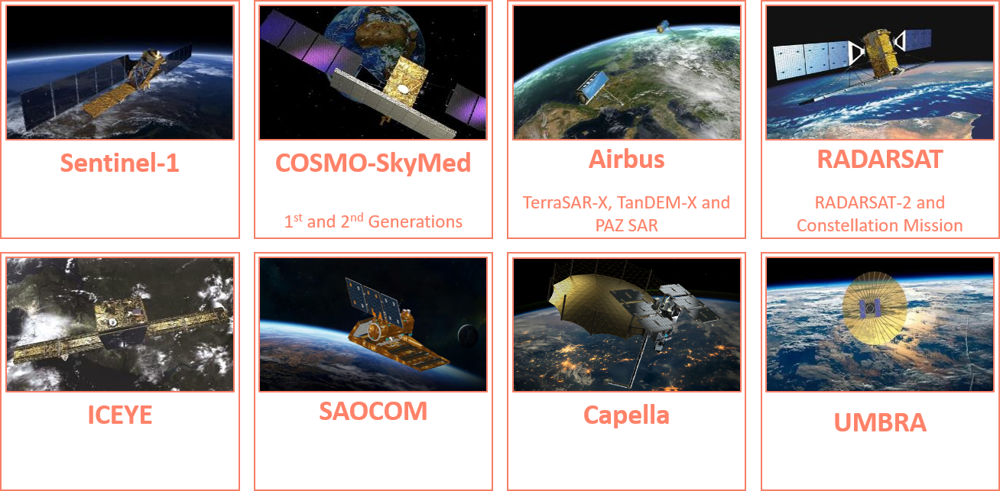

# SAR data

You will find a SAR tutorial [here](https://eoreader.readthedocs.io/en/latest/notebooks/SAR.html).

## Implemented SAR constellations



| Constellations                      | Class                                                         | Use archive                               |
|-------------------------------------|---------------------------------------------------------------|-------------------------------------------|
| `Capella`                           | {meth}`~eoreader.products.sar.capella_product.CapellaProduct` | ❌                                         |
| `COSMO-Skymed 1st Generation`       | {meth}`~eoreader.products.sar.csk_product.CskProduct`         | ❌                                         |
| `COSMO-Skymed 2nd Generation`       | {meth}`~eoreader.products.sar.csg_product.CsgProduct`         | ❌                                         |
| `ICEYE`                             | {meth}`~eoreader.products.sar.iceye_product.IceyeProduct`     | ❌                                         |
| `RADARSAT Constellation Mission`    | {meth}`~eoreader.products.sar.rcm_product.RcmProduct`         | ❌                                         |
| `RADARSAT-2`                        | {meth}`~eoreader.products.sar.rs2_product.Rs2Product`         | ✅ for ground range data, ❌ for complex data |
| `Sentinel-1`                        | {meth}`~eoreader.products.sar.s1_product.S1Product`           | ✅                                         |
| `Sentinel-1 RTC`                    | {meth}`~eoreader.products.sar.s1_product.S1RtcProduct`        | ✅ for ASF                                 |
| `SAOCOM-1`                          | {meth}`~eoreader.products.sar.saocom_product.SaocomProduct`   | ❌                                         |
| `TerraSAR-X`, `TanDEM-X`, `PAZ SAR` | {meth}`~eoreader.products.sar.tsx_product.TsxProduct`         | ❌                                         |

```{warning}
Satellites products that cannot be used as archived have to be extracted before use, 
mostly because SNAP doesn't handle them.
```

## Product type handling

| Constellations                      | Product Type                                                                                                                                                  | Handled |
|-------------------------------------|---------------------------------------------------------------------------------------------------------------------------------------------------------------|---------|
| `Capella`                           | SLC                                                                                                                                                           | ✅       |
| `Capella`                           | GEC                                                                                                                                                           | ✅       |
| `Capella`                           | GEO                                                                                                                                                           | ✅       |
| `Capella`                           | SICD, SIDD, CPHD                                                                                                                                              | ❌       |
| `COSMO-Skymed`                      | SCS                                                                                                                                                           | ✅       |
| `COSMO-SkyMed` 1st Generation       | DGM                                                                                                                                                           | ✅       |
| `COSMO-SkyMed` 2nd Generation       | DGM                                                                                                                                                           | ⚠       |
| `COSMO-SkyMed`                      | GEC, GTC                                                                                                                                                      | ⚠       |
| `ICEYE`                             | SLC                                                                                                                                                           | ✅       |
| `ICEYE`                             | GRD                                                                                                                                                           | ✅       |
| `ICEYE`                             | ORTHO                                                                                                                                                         | 💤      |
| `RADARSAT Constellation Mission`    | SLC                                                                                                                                                           | ⚠       | 
| `RADARSAT Constellation Mission`    | GRC, GCC, GCD                                                                                                                                                 | ⚠       |
| `RADARSAT Constellation Mission`    | GRD                                                                                                                                                           | ✅       | 
| `RADARSAT-2`                        | SLC                                                                                                                                                           | ✅       | 
| `RADARSAT-2`                        | SGF, SGX, SSG                                                                                                                                                 | ✅       |
| `RADARSAT-2`                        | SCN, SCF, SCW, SCS, SPG                                                                                                                                       | ⚠       |
| `Sentinel-1`                        | SLC                                                                                                                                                           | ✅       | 
| `Sentinel-1`                        | GRD                                                                                                                                                           | ✅       |
| `Sentinel-1`                        | RTC ([ASF](https://hyp3-docs.asf.alaska.edu/guides/rtc_product_guide/#readme-file) and [MPC](https://planetarycomputer.microsoft.com/dataset/sentinel-1-rtc)) | ✅       |
| `SAOCOM-1`                          | SLC                                                                                                                                                           | ✅       | 
| `SAOCOM-1`                          | ID                                                                                                                                                            | ⚠       |
| `SAOCOM-1`                          | GEC                                                                                                                                                           | ✅       |
| `SAOCOM-1`                          | GTC                                                                                                                                                           | ✅       |
| `TerraSAR-X`, `TanDEM-X`, `PAZ SAR` | SSC                                                                                                                                                           | ✅       | 
| `TerraSAR-X`, `TanDEM-X`, `PAZ SAR` | MGD                                                                                                                                                           | ✅       |
| `TerraSAR-X`, `TanDEM-X`, `PAZ SAR` | GEC                                                                                                                                                           | ⚠       |
| `TerraSAR-X`, `TanDEM-X`, `PAZ SAR` | EEC                                                                                                                                                           | ✅       |

✅: Tested   
⚠: Never tested, **use it at your own risk!**  
❌: Not handled   
💤: Waiting for the release  

The goal of **EOReader** is to implement every constellation that can be used in
the [Copernicus Emergency Management Service](https://emergency.copernicus.eu/).
The constellations that can be used during CEMS activations are (as of 09/2021):  


## SAR Bands

```{warning}
- **EOReader** always loads SAR bands in a GRD format. This library is not (yet ?) meant to manage inSAR or other complex processes.
- Only the `Intensity` bands are used (not the `I`, `Q` for complex data or `Amplitude` for ground range data)
- Some SAR band may contain null pixels that are not really nodata (COSMO for example).  
    In this case, the Terrain Correction step applied by SNAP can create large nodata area.  
    If this is the case, you can set the keyword {meth}`~eoreader.keywords.SAR_INTERP_NA` to True when loading or stacking SAR data
```

According to what contains the products, allowed SAR bands are:

- {meth}`~eoreader.bands.band_names.SarBandNames.VV`
- {meth}`~eoreader.bands.band_names.SarBandNames.VH`
- {meth}`~eoreader.bands.band_names.SarBandNames.HH`
- {meth}`~eoreader.bands.band_names.SarBandNames.HV`
- {meth}`~eoreader.bands.band_names.SarBandNames.RH` (only for RADARSAT-Constellation)
- {meth}`~eoreader.bands.band_names.SarBandNames.RV` (only for RADARSAT-Constellation)

You also can load despeckled bands:

- {meth}`~eoreader.bands.band_names.SarBandNames.VV_DSPK`
- {meth}`~eoreader.bands.band_names.SarBandNames.VH_DSPK`
- {meth}`~eoreader.bands.band_names.SarBandNames.HH_DSPK`
- {meth}`~eoreader.bands.band_names.SarBandNames.HV_DSPK`
- {meth}`~eoreader.bands.band_names.SarBandNames.RH_DSPK` (only for RADARSAT-Constellation)
- {meth}`~eoreader.bands.band_names.SarBandNames.RV_DSPK` (only for RADARSAT-Constellation)

### Available indices

EOReader uses (from version 0.18.0) the indices described in
the [awesome spectral indices (ASI)](https://awesome-ee-spectral-indices.readthedocs.io/en/latest/) project.

ASI implements SAR indices, with the list available [here](https://awesome-ee-spectral-indices.readthedocs.io/en/latest/list.html#radar).

## DEM bands

These bands need a valid worldwide DEM path positioned thanks to the environment variable `EOREADER_SAR_DEFAULT_RES`

- `DEM`
- `SLOPE`

SAR constellations can only load {meth}`~eoreader.bands.band_names.DemBandNames.DEM` and {meth}`~eoreader.bands.band_names.DemBandNames.SLOPE`
bands as the sun position does not impact SAR data. The `SLOPE` band is given in degrees. Please post an issue if you
need this band in `percent`.

These bands need a valid worldwide DEM path positioned thanks to the environment variable `EOREADER_DEM_PATH`.
You can use both a local path e.g. `/mnt/dataserver/dems/srtm_30_v4/index.vrt` or `\\dataserver\DEMS\srtm_30_v4\index.vrt` or
a URL pointing to a web resources hosted on a S3 compatible storage e.g. 
`https://s3.storage.com/dem-bucket/srtm_cog.tif` (not available on Windows for now).

## Default pixel size and resolution

The default resolution of SAR products is the one given in 
[Data Access Portfolio (2014-2022, section 6.2)](https://spacedata.copernicus.eu/documents/20126/0/DAP+Document+-+current+(10).pdf). 
For resolutions not available in this document, we are using the pixel spacing given by the constellation's provider.
Complex data are **always** converted back to ground range to be used, so the complex resolution is **never** used by EOReader.

The default pixel size of GRD bands is not the same as the product resolution! (i.e. pixel size of 10m with a resolution of 20m for Sentinel-1 IW data)

```{warning}
⚠ Pay attention that for a pixel spacing of 10 meters and a rg x az resolution of 23m, objects under 23m won't be resolved !
As this may be counter-intuitive, it is recommanded to **always** specify the pixel size when loading SAR data.
```

```{note}
Resolution is not used in EOReader, only the pixel_size. Resolution is juste specified as an information.
For now, resolutions are stored with only one number in EOReader (not rg x az, only one of the two, which will be in bold here after). 
If this needs change, don't hesitate to write an issue :) 
```


### Sentinel-1

| **Sentinel-1**                  | Ground Range Detected (GRD)<br>Full Resolution (FR) | Ground Range Detected (GRD)<br>High Resolution (HR)  | Ground Range Detected (GRD)<br>Medium Resolution (MR)           |
|---------------------------------|-----------------------------------------------------|------------------------------------------------------|-----------------------------------------------------------------|
| StripMap (SM)                   | **pixel size: 3.5 m**<br>rg x az resolution: 9.0 m  | **pixel size: 10.0 m**<br>rg x az resolution: 23.0 m | **pixel size: 40.0 m**<br>rg x az resolution: 84.0 m            |
| Interferometric Wide swath (IW) |                                                     | **pixel size: 10.0 m**<br>rg x az resolution: 20.0 m | **pixel size: 40.0 m**<br>rg x az resolution: 88.0 x **87.0** m |
| Extra-Wide swath (EW)           |                                                     | **pixel size: 25.0 m**<br>rg x az resolution: 25.0 m | **pixel size: 40.0 m**<br>rg x az resolution: 93.0 x **87.0** m |
| Wave (WV)                       |                                                     |                                                      | **pixel size: 25.0 m**<br>rg x az resolution: 52.0 x **51.0** m |


### COSMO-Skymed 1st Generation

| **COSMO-Skymed<br>1st Generation**   | Detected Ground Multi-look (DGM)<br>Geocoded Ellipsoid Corrected (GEC)<br>Geocoded Terrain Corrected (GTC) |
|--------------------------------------|------------------------------------------------------------------------------------------------------------|
| **Spotlight**<br>Mode-2 (S2)         | **pixel size: 0.5 m**<br>rg x az resolution: 1.0 m                                                         | 
| **StripMap**<br>Himage from SCS (HI) | **pixel size: 2.5 m**<br>rg x az resolution: 3.0 m                                                         |
| **StripMap**<br>Himage GRD (HI)      | **pixel size: 2.5 m**<br>rg x az resolution: 5.0 m                                                         |
| **StripMap**<br>PingPong (PP)        | **pixel size: 10.0 m**<br>rg x az resolution: 20.0 m                                                       |
| **ScanSAR**<br>Wide Region (WR)      | **pixel size: 15.0 m**<br>rg x az resolution: 30.0 m                                                       |
| **ScanSAR**<br>Huge Region (HR)      | **pixel size: 50.0 m**<br>rg x az resolution: 100.0 m                                                      |

### COSMO-Skymed 2nd Generation

| **COSMO-Skymed<br>2nd Generation** | Detected Ground Multi-look (DGM)<br>Geocoded Ellipsoid Corrected (GEC)<br>Geocoded Terrain Corrected (GTC)                                                                                                            |
|------------------------------------|-----------------------------------------------------------------------------------------------------------------------------------------------------------------------------------------------------------------------|
| SPOTLIGHT 2A                       | Multilook ID: #1: **pixel size: 0.15 m**, rg x az resolution: 0.4 m<br>Multilook ID: #2: **pixel size: 0.3 m**, rg x az resolution: 0.7 m<br>Multilook ID: #3: **pixel size: 0.45 m**, rg x az resolution: 1.0 m      |
| SPOTLIGHT 2B                       | Multilook ID: #1: **pixel size: 0.25 m**, rg x az resolution: 0.7 m<br>Multilook ID: #2: **pixel size: 0.5 m**, rg x az resolution: 1.2 m<br>Multilook ID: #3: **pixel size: 1.0 m**, rg x az resolution: 2.3 m       |
| SPOTLIGHT 2C                       | Multilook ID: #1: **pixel size: 0.3 m**, rg x az resolution: 0.8 m<br>Multilook ID: #2: **pixel size: 0.6 m**, rg x az resolution: 1.4 m<br>Multilook ID: #3: **pixel size: 0.9 m**, rg x az resolution: 2.1 m        |
| STRIPMAP & QUADPOL                 | Multilook ID: #1: **pixel size: 1.25 m**, rg x az resolution: 3.0 m<br>Multilook ID: #2: **pixel size: 2.5 m**, rg x az resolution: 5.6 m<br>Multilook ID: #3: **pixel size: 5.0 m**, rg x az resolution: 11.2 m      |
| SCANSAR1                           | Multilook ID: #1: **pixel size: 5.0 m**, rg x az resolution: 20.0 m<br>Multilook ID: #2: **pixel size: 10.0 m**, rg x az resolution: 23.0 m<br>Multilook ID: #3: **pixel size: 15.0 m**, rg x az resolution: 35.0 m   |
| SCANSAR2                           | Multilook ID: #1: **pixel size: 10.0 m**, rg x az resolution: 40.0 m<br>Multilook ID: #2: **pixel size: 20.0 m**, rg x az resolution: 47.0 m<br>Multilook ID: #3: **pixel size: 50.0 m**, rg x az resolution: 115.0 m |
| PINGPONG                           | Multilook ID: #1: **pixel size: 2.0 m**, rg x az resolution: 12.0 m<br>Multilook ID: #2: **pixel size: 4.0 m**, rg x az resolution: 12.0 m<br>Multilook ID: #3: **pixel size: 10.0 m**, rg x az resolution: 22.5 m    |

### TerraSAR-X & TanDEM-X & PAZ SAR

| **TerraSAR-X<br>TanDEM-X<br>PAZ SAR**            | Multi Look Ground Range (MGD)<br>Geocoded Ellipsoid Corrected (GEC)<br>Enhanced Ellipsoid Corrected (EEC)<br>Spatially enhanced<br> |
|--------------------------------------------------|-------------------------------------------------------------------------------------------------------------------------------------|
| **StripMap (SM)**<br>Single-Pol                  | **pixel size: 1.25 m**<br>rg x az resolution: 3.3 m                                                                                 |
| **StripMap (SM)**<br>Dual-Pol                    | **pixel size: 3.0 m**<br>rg x az resolution: 6.6 m                                                                                  |
| **High Resolution Spotlight (HS)**<br>Single-Pol | **pixel size: 0.5 m**<br>rg x az resolution: 1.1 m                                                                                  |
| **High Resolution Spotlight (HS)**<br>Dual-Pol   | **pixel size: 1.0 m**<br>rg x az resolution: 2.2 m                                                                                  |
| **Spotlight (SL)**<br>Single-Pol                 | **pixel size: 0.75 m**<br>rg x az resolution: 1.7 m                                                                                 |
| **Spotlight (SL)**<br>Dual-Pol                   | **pixel size: 1.0 m**<br>rg x az resolution: 3.4 m                                                                                  |
| **Staring Spotlight (ST)**<br>Single-Pol         | **pixel size: 0.2 m**<br>rg x az resolution: 0.24 m                                                                                 |
| **ScanSAR (SC)**<br>Four Beams                   | **pixel size: 8.25 m**<br>rg x az resolution: 18.5 m                                                                                |
| **ScanSAR (SC)**<br>Six Beams                    | **pixel size: 15.0 m**<br>rg x az resolution: 40.0 m                                                                                |

```{note}
All product types are used in high resolution (SE), as the high radiometry products are not used in Copernicus Emergency Management Service. 
This is not the case for ScanSAR products, always delivered in RE.
If you want all the RE products implemented, don't hesitate to write an issue :)
```

### RADARSAT-2

#### Classic modes
| **RADARSAT-2**                              | SAR georeferenced extra (SGX)                                                       | SAR georeferenced fine (SGF)                          | SAR systematic geocorrected(SSG)<br>SAR precision geocorrected (SPG) |
|---------------------------------------------|-------------------------------------------------------------------------------------|-------------------------------------------------------|----------------------------------------------------------------------|
| Spotlight                                   | **pixel size: 0.8 m _(1.0 if incidence angle < 48°)_**<br>rg x az resolution: 0.8 m | **pixel size: 0.5 m**<br>rg x az resolution: 0.8 m    | **pixel size: 0.5 m**<br>rg x az resolution: 0.8 m                   |
| Ultra-Fine<br>Wide Ultra-Fine               | **pixel size: 0.8 m _(1.0 if incidence angle < 48°)_**<br>rg x az resolution: 2.8 m | **pixel size: 1.5625 m**<br>rg x az resolution: 2.8 m | **pixel size: 1.5625 m**<br>rg x az resolution: 2.8 m                |
| Multi-Look Fine<br>Wide Multi-Look Fine     | **pixel size: 3.125 m**<br>rg x az resolution: 7.6 m                                | **pixel size: 6.25 m**<br>rg x az resolution: 7.6 m   | **pixel size: 6.25 m**<br>rg x az resolution: 7.6 m                  |
| Extra-Fine /*                               | **pixel size: 2.0 m**<br>rg x az resolution: 4.6 m                                  | **pixel size: 3.125 m**<br>rg x az resolution: 4.6 m  | **pixel size: 3.125 m**<br>rg x az resolution: 4.6 m                 |
| Fine<br>Wide-Fine                           | **pixel size: 3.125 m**<br>rg x az resolution: 7.7 m                                | **pixel size: 6.25 m**<br>rg x az resolution: 7.7 m   | **pixel size: 6.25 m**<br>rg x az resolution: 7.7 m                  |
| Standard<br>Wide                            | **pixel size: 8.0 m**<br>rg x az resolution: 24.7 m                                 | **pixel size: 12.5 m**<br>rg x az resolution: 24.7 m  | **pixel size: 12.5 m**<br>rg x az resolution: 24.7 m                 |
| Extended High                               | **pixel size: 8.0 m**<br>rg x az resolution: 24.7 m                                 | **pixel size: 12.5 m**<br>rg x az resolution: 24.7 m  | **pixel size: 12.5 m**<br>rg x az resolution: 24.7 m                 |
| Extended Low                                | **pixel size: 10.0 m**<br>rg x az resolution: 24.7 m                                | **pixel size: 12.5 m**<br>rg x az resolution: 24.7 m  | **pixel size: 12.5 m**<br>rg x az resolution: 24.7 m                 |
| Fine Quad-Pol<br>Wide Quad-Pol              | **pixel size: 3.125 m**<br>rg x az resolution: 7.6 m                                |                                                       | **pixel size: 3.125 m**<br>rg x az resolution: 7.6 m                 |
| Standard Quad-Pol<br>Wide Standard Quad-Pol | **pixel size: 8.0 m**<br>rg x az resolution: 7.6 m                                  |                                                       | **pixel size: 8.0 m**<br>rg x az resolution: 7.6 m                   |

* Only the Extra-Fine mode with 1 look is taken into account. Pixel sizes can change with 4 or 28 looks.

#### ScanSAR mode
| **RADARSAT-2**              | ScanSAR narrow beam (SCN)                            | ScanSAR wide beam (SCW)                               | ScanSAR fine (SCF)<br>ScanSAR sampled (SCS            |
|-----------------------------|------------------------------------------------------|-------------------------------------------------------|-------------------------------------------------------|
| ScanSAR Narrow              | **pixel size: 25.0 m**<br>rg x az resolution: 50.0 m |                                                       | **pixel size: 25.0 m**<br>rg x az resolution: 50.0 m  |
| ScanSAR Wide                |                                                      | **pixel size: 50.0 m**<br>rg x az resolution: 100.0 m | **pixel size: 50.0 m**<br>rg x az resolution: 100.0 m |

#### Other modes

| **RADARSAT-2**              | From SLC                                             | Other product types                                  |
|-----------------------------|------------------------------------------------------|------------------------------------------------------|
| Ship (Detection of vessels) | **pixel size: 20.0 m**<br>rg x az resolution: 35.0 m | **pixel size: 40.0 m**<br>rg x az resolution: 35.0 m |
| Ocean Surveillance          | **pixel size: 35.0 m**<br>rg x az resolution: 50.0 m | **pixel size: 50.0 m**<br>rg x az resolution: 50.0 m |


### RADARSAT-Constellation

| **RADARSAT-Constellation**          | Pixel size and Resolution                             |
|-------------------------------------|-------------------------------------------------------|
| Spotlight [FSL]                     | **pixel size: 0.33 m**<br>rg x az resolution: 1.0 m   |
| Very-High Resolution, 3 meters [3M] | **pixel size: 1.25 m**<br>rg x az resolution: 3.0 m   |
| High Resolution, 5 meters [5M]      | **pixel size: 2.0 m**<br>rg x az resolution: 5.0 m    |
| Quad-Polarization [QP]              | **pixel size: 2.5 m**<br>rg x az resolution: 9.0 m    |
| Medium Resolution, 16 meters [16M]  | **pixel size: 6.25 m**<br>rg x az resolution: 16.0 m  |
| Medium Resolution, 30 meters [SC30] | **pixel size: 12.5 m**<br>rg x az resolution: 30.0 m  |
| Medium Resolution, 50 meters [SC50] | **pixel size: 20.0 m**<br>rg x az resolution: 50.0 m  |
| Low Noise [SCLN]                    | **pixel size: 40.0 m**<br>rg x az resolution: 100.0 m |
| Low Resolution, 100 meters [SC100]  | **pixel size: 40.0 m**<br>rg x az resolution: 100.0 m |
| Ship Detection                      | Variable                                              |

### ICEYE

| **ICEYE**         | Pixel size and Resolution                           |
|-------------------|-----------------------------------------------------|
| Spotlight [SL(H)] | **pixel size: 0.5 m**<br>rg x az resolution: 1.0 m  |
| StripMap [SM(H)]  | **pixel size: 2.5 m**<br>rg x az resolution: 3.0 m  |
| Scan [SC]         | **pixel size: 6.0 m**<br>rg x az resolution: 15.0 m |

### SAOCOM-1

| **SAOCOM-1**                                  | Detected Image (DI)<br>Geocoded Ellipsoid Corrected (GEC)<br>Geocoded Terrain Corrected (GTC) |
|-----------------------------------------------|-----------------------------------------------------------------------------------------------|
| **StripMap (SM)**<br>Single and Dual Pol      | **pixel size: 5.0 m**<br>rg x az resolution: 10.0 m                                           |
| **StripMap (SM)**<br>Quad Pol                 | **pixel size: 5.0 m**<br>rg x az resolution: 10.0 m                                           |
| **TOPSAR Narrow (TN)**<br>Single and Dual Pol | **pixel size: 15.0 m**<br>rg x az resolution: 30.0 m                                          |
| **TOPSAR Narrow (TN)**<br>Quad Pol            | **pixel size: 25.0 m**<br>rg x az resolution: 50.0 m                                          |
| **TOPSAR Wide (TW)**<br>Single and Dual Pol   | **pixel size: 25.0 m**<br>rg x az resolution: 50.0 m                                          |
| **TOPSAR Wide (TW)**<br>Quad Pol              | **pixel size: 50.0 m**<br>rg x az resolution: 100.0 m                                         |

```{warning}
It has been impossible to find the recommmanded pixel size from SAOCOM products.
They have been set to half the resolution (as it is usually the case)

If you have more information about this, please write an issue!
```

### Capella

| **ICEYE**              | Pixel size and Resolution                           |
|------------------------|-----------------------------------------------------|
| Spotlight [SP]         | **pixel size: 0.35 m**<br>rg x az resolution: 0.5 m |
| StripMap [SM]          | **pixel size: 0.6 m**<br>rg x az resolution: 1.0 m  |
| Sliding Spotlight [SS] | **pixel size: 0.8 m**<br>rg x az resolution: 1.2 m  |                                                                                    |

## GPT graphs

You can change the SAR GPT graphs used by setting the following environment variables:

- `EOREADER_PP_GRAPH`: Environment variables for pre-processing graph path.
- `EOREADER_DSPK_GRAPH`: Environment variables for despeckling graph path

```{warning}
For performance reasons, the `Terrain Correction` step is done **before** the `Despeckle` step. Indeed this step is very
time-consuming and better done one time on the raw image than two times on both the raw and the despeckled image. Even
if this is not the regular way of handling SAR data, this shouldn't really affect the quality of any extraction done
after that.
```

You can change the DEM used for the Terrain Correction step by positioning the `EOREADER_SNAP_DEM_NAME` environment variable. 
Available DEMs are:
- `ACE2_5Min` 
- `ACE30`
- `ASTER 1sec GDEM`
- `Copernicus 30m Global DEM` (by default)
- `Copernicus 90m Global DEM`
- `GETASSE30`
- `SRTM 1Sec HGT`
- `SRTM 3Sec`
- `External DEM`

If `External DEM` is set, you must specify the DEM you want by positioning the `EOREADER_DEM_PATH` to a DEM that can be read by SNAP.

## Known SNAP bugs

See the [FAQ](https://eoreader.readthedocs.io/en/latest/faq.html#snap-known-bugs) for known SNAP bugs.

### What to know if you are changing a graph

Those graphs should have a reader and a writer on this model:

```xml

<graph id="Graph">
 <version>1.0</version>
 <node id="Read">
  <operator>Read</operator>
  <sources/>
  <parameters class="com.bc.ceres.binding.dom.XppDomElement">
  <file>$file</file>
  </parameters>
 </node>
 <node id="Write">
  <operator>Write</operator>
  <sources>
  <sourceProduct refid="????"/>
  </sources>
  <parameters class="com.bc.ceres.binding.dom.XppDomElement">
  <file>$out</file>
  <formatName>BEAM-DIMAP</formatName>
  </parameters>
 </node>
</graph>
```

```{warning}
Pay attention to set `$file` and `$out` and leave the `BEAM-DIMAP` file format. The first graph must orthorectify your
SAR data, but should not despeckle it. The second graph is precisely charged to do it.

SNAP graphs are run on every band separatly.

 The pre-processing graph should also have a `Calibration` and a `Terrain Correction` step with the following wildcards that are set automatically in the module:

 - `$calib_pola`: Polarization of the band to calibrate
 - `$dem_name`: SNAP DEM name
 - `$dem_path`: DEM path (that can be use by SNAP, so only TIFF DEMs)
 - `$res_m`: Resolution in meters
 - `$res_deg`: Resolution in degrees
 - `$crs`: CRS
 - The nodata value should **always** be set to 0.
```

The default `Calibration` step is:

```xml
<node id="Calibration">
    <operator>Calibration</operator>
    <sources>
        <sourceProduct refid="ThermalNoiseRemoval"/>
    </sources>
    <parameters class="com.bc.ceres.binding.dom.XppDomElement">
        <sourceBands/>
        <auxFile>Latest Auxiliary File</auxFile>
        <externalAuxFile/>
        <outputImageInComplex>false</outputImageInComplex>
        <outputImageScaleInDb>false</outputImageScaleInDb>
        <createGammaBand>false</createGammaBand>
        <createBetaBand>false</createBetaBand>
        <selectedPolarisations>${calib_pola}</selectedPolarisations>
        <outputSigmaBand>true</outputSigmaBand>
        <outputGammaBand>false</outputGammaBand>
        <outputBetaBand>false</outputBetaBand>
    </parameters>
</node>
```

The default `Terrain Correction` step is:

```xml
<node id="Terrain-Correction">
    <operator>Terrain-Correction</operator>
    <sources>
        <sourceProduct refid="LinearToFromdB"/>
    </sources>
    <parameters class="com.bc.ceres.binding.dom.XppDomElement">
        <sourceBands/>
        <demName>${dem_name}</demName>
        <externalDEMFile>${dem_path}</externalDEMFile>
        <externalDEMNoDataValue>0.0</externalDEMNoDataValue>
        <externalDEMApplyEGM>true</externalDEMApplyEGM>
        <demResamplingMethod>BILINEAR_INTERPOLATION</demResamplingMethod>
        <imgResamplingMethod>BILINEAR_INTERPOLATION</imgResamplingMethod>
        <pixelSpacingInMeter>${res_m}</pixelSpacingInMeter>
        <pixelSpacingInDegree>${res_deg}</pixelSpacingInDegree>
        <mapProjection>${crs}</mapProjection>
        <alignToStandardGrid>false</alignToStandardGrid>
        <standardGridOriginX>0.0</standardGridOriginX>
        <standardGridOriginY>0.0</standardGridOriginY>
        <nodataValueAtSea>false</nodataValueAtSea>
        <saveDEM>false</saveDEM>
        <saveLatLon>false</saveLatLon>
        <saveIncidenceAngleFromEllipsoid>false</saveIncidenceAngleFromEllipsoid>
        <saveLocalIncidenceAngle>false</saveLocalIncidenceAngle>
        <saveProjectedLocalIncidenceAngle>false</saveProjectedLocalIncidenceAngle>
        <saveSelectedSourceBand>true</saveSelectedSourceBand>
        <applyRadiometricNormalization>false</applyRadiometricNormalization>
        <saveSigmaNought>false</saveSigmaNought>
        <saveGammaNought>false</saveGammaNought>
        <saveBetaNought>false</saveBetaNought>
        <incidenceAngleForSigma0>Use projected local incidence angle from DEM</incidenceAngleForSigma0>
        <incidenceAngleForGamma0>Use projected local incidence angle from DEM</incidenceAngleForGamma0>
        <auxFile>Latest Auxiliary File</auxFile>
        <externalAuxFile/>
    </parameters>
</node>
```

### Default SNAP resolution

You can override default SNAP pixel spacing (in meters) when geocoding SAR bands by setting the following environment
variable:

- `EOREADER_SAR_DEFAULT_RES`: 0.0 by default, which means using the product's default pixel spacing

## Documentary Sources

- [Data Access Portfolio (2014-2022)](https://spacedata.copernicus.eu/documents/20123/121286/DAP+Release+phase2_Latest.pdf)

### Copernicus 
- [Copernicus Contributing Missions](https://www.esa.int/ESA_Multimedia/Images/2021/09/Copernicus_Contributing_Missions_overview)

### Sentinel-1

- [Data Products](https://sentinel.esa.int/web/sentinel/missions/sentinel-1/data-products)
- [Acquisition Mode](https://sentinel.esa.int/web/sentinel/user-guides/sentinel-1-sar/acquisition-modes)
- [S1 RTC](https://hyp3-docs.asf.alaska.edu/guides/rtc_product_guide/#readme-file)

### RADARSAT

- [RADARSAT-2 Product Description](https://catalyst.earth/catalyst-system-files/help/references/gdb_r/RADARSAT-2.html)
- [RADARSAT-Constellation Product Description](https://www.asc-csa.gc.ca/eng/satellites/radarsat/technical-features/characteristics.asp)
- [Comparison between RS2 and RCM](https://www.asc-csa.gc.ca/eng/satellites/radarsat/technical-features/radarsat-comparison.asp)
- [RS2 Product Description](https://earth.esa.int/eogateway/documents/20142/0/Radarsat-2-Product-description.pdf/f2783c7b-6a22-cbe4-f4c1-6992f9926dca)
- [RCM Product Specification](https://ftp.maps.canada.ca/pub/csa_asc/Space-technology_Technologie-spatiale/radarsat_constellation_mission_plan/RCM-SP-52-9092_Product_Spec_1-15_Public.pdf)

### COSMO-Skymed

- [COSMO-Skymed 1st Generation Product Description](https://earth.esa.int/eogateway/missions/cosmo-skymed)
- [COSMO-Skymed 1st Generation Product Description 2](https://catalyst.earth/catalyst-system-files/help/references/gdb_r/SPW_reuse/COSMO-SkyMed.html)
- [COSMO-Skymed 1st Generation Product Handbook](https://earth.esa.int/eogateway/documents/20142/37627/Cosmo-SkyMed-Product-Handbook.pdf)
- [COSMO-Skymed 2nd Generation System and Products Description](https://earth.esa.int/eogateway/documents/20142/37627/COSMO-SkyMed-Second-Generation-Mission-Products-Description.pdf)

### TerraSAR-X, TanDEM-X and PAZ SAR

- [TerraSAR-X & TanDEM-X Product Description](https://tandemx-science.dlr.de/pdfs/TX-GS-DD-3302_Basic-Products-Specification-Document_V1.9.pdf)
- [TerraSAR-X & TanDEM-X Product Description 2](https://catalyst.earth/catalyst-system-files/help/references/gdb_r/TerraSAR-X.html)
- [PAZ SAR Image Product Guide](https://www.hisdesat.es/wp-content/uploads/2019/10/PAZ-HDS-GUI-001-PAZ-Image-Product-Guide-issue-1.1-.pdf)
- [PAZ SAR Product Description](https://catalyst.earth/catalyst-system-files/help/references/gdb_r/PAZ.html)

### ICEYE

- [ICEYE Product Specifications](https://www.iceye.com/hubfs/Downloadables/ICEYE-Level-1-Product-Specs-2019.pdf)
- [ICEYE Product Documentation](https://iceye-ltd.github.io/product-documentation/5.1/)

### SAOCOM-1
- [SAOCOM Description](https://saocom.veng.com.ar/en/)
- [SAOCOM Product Format](https://saocom.veng.com.ar/L1-product-format-EN.pdf)
- [SAOCOM Data Products](https://earth.esa.int/eogateway/catalog/saocom-data-products)

### Capella
- [Capella SAR Imagery Products](https://support.capellaspace.com/hc/en-us/categories/360002612692-SAR-Imagery-Products)
- [Capella Product Guide](https://support.capellaspace.com/hc/en-us/articles/4626115099796-SAR-Imagery-Products-Guide)
- [Capella Products Format Specification](https://support.capellaspace.com/hc/en-us/articles/5607458273940-SAR-Imagery-Products-Format-Specification)

*Documentation last accessed on the 04/12/2023*